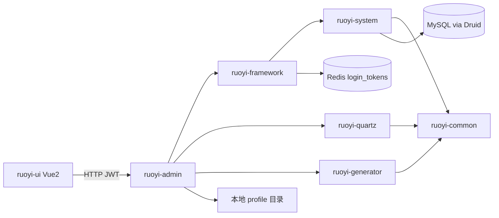
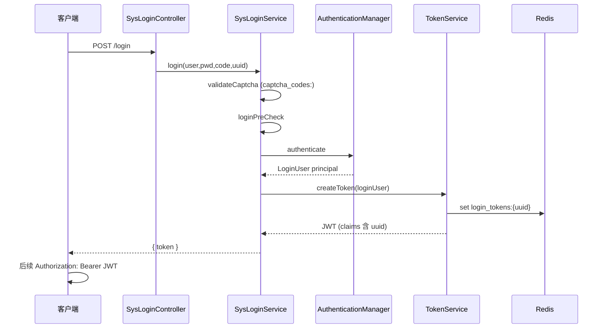
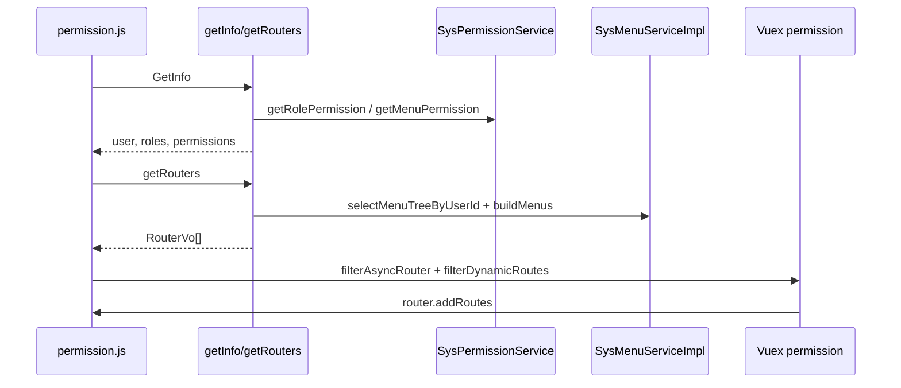

# 系统架构与运行链路

> **审计快照：** 本文基于 2026-07-21 审计基线，后续代码变化不会自动反映。基线与限制见[审计总览](./README.md)，当前能力导航见[知识库首页](../README.md)。

## 系统全景

RuoYi-Vue 是前后端分离的管理后台：后端以 `ruoyi-admin` 为 Spring Boot 可执行入口，前端 `ruoyi-ui` 通过 HTTP 调用后端 API。身份采用 **JWT + Redis 会话**；业务数据落关系型数据库（默认 MySQL + Druid Profile）；上传文件落本地 `ruoyi.profile` 目录并映射为 `/profile/**`。



## Maven 模块与依赖

父 POM 声明六个模块，版本属性为 `ruoyi.version=3.9.2`、`java.version=17`、`spring-boot.version=4.0.6`（`pom.xml:16-20`、`177-182`）。

| 模块 | 角色 | 直接依赖（POM） |
| --- | --- | --- |
| `ruoyi-admin` | 启动入口、Controller、运行配置 | `ruoyi-framework`、`ruoyi-quartz`、`ruoyi-generator` |
| `ruoyi-framework` | Security、JWT、切面、异常、资源与 CORS | `ruoyi-system`（及 Spring Security 等） |
| `ruoyi-system` | 用户/角色/菜单等系统业务 | `ruoyi-common` |
| `ruoyi-quartz` | 定时任务 | `ruoyi-common` |
| `ruoyi-generator` | 代码生成 | `ruoyi-common` |
| `ruoyi-common` | 领域模型、常量、工具、缓存封装 | 第三方库（无其他 ruoyi 模块） |

依赖方向（有效业务链路）：

```text
admin → framework → system → common
admin → quartz → common
admin → generator → common
```

当前审计环境无 JDK/Maven，未能运行 `dependency:tree`；上表来自各模块 `pom.xml` 直接声明。

## 后端分层职责

| 层 | 位置 | 职责 |
| --- | --- | --- |
| 入口 | `ruoyi-admin/.../RuoYiApplication.java` | `@SpringBootApplication`，排除默认数据源自动配置（`RuoYiApplication.java:12-18`） |
| Web | `ruoyi-admin/.../web/controller/**` | REST 接口，如登录 `SysLoginController`、通用上传 `CommonController` |
| 安全与横切 | `ruoyi-framework` | `SecurityConfig`、`JwtAuthenticationTokenFilter`、`TokenService`、`DataScopeAspect`、`GlobalExceptionHandler`、`ResourcesConfig` |
| 业务服务 | `ruoyi-system` / `ruoyi-quartz` / `ruoyi-generator` | Service + Mapper |
| 公共 | `ruoyi-common` | `LoginUser`、常量、文件工具、Redis 封装等 |

## 前端与后端边界

- 前端白名单路由：`/login`、`/register`（`ruoyi-ui/src/permission.js:12-16`）。
- 有 Token 时：`GetInfo` → `GenerateRoutes` → `router.addRoutes`（`permission.js:36-45`）。
- 后端菜单：`GET getRouters` → `menuService.selectMenuTreeByUserId` → `buildMenus` 返回 `RouterVo`（`SysLoginController.java:101-106`）。
- 前端将字符串组件名解析为视图：`Layout` / `ParentView` / `InnerLink` 或 `loadView('@/views/...')`（`store/modules/permission.js:56-71`、`113-119`）。
- 本地 `dynamicRoutes` 再按 `permissions`/`roles` 过滤后 `addRoutes`（`permission.js:41-43`、`97-110`）。

边界约定：后端不下发可执行前端代码，只下发路由元数据；按钮权限以后端权限集合 + 前端指令共同约束，接口仍依赖 `@PreAuthorize`。

## 启动与配置装配

1. `RuoYiApplication.main` 启动 Spring Boot（`RuoYiApplication.java:15-18`）。
2. 排除 `DataSourceAutoConfiguration`，数据源由 Druid 等自定义配置接入（`RuoYiApplication.java:12`）。
3. 主配置 `application.yml`：服务端口、Redis、token 键、MyBatis、springdoc、XSS、`ruoyi.profile` 等（`application.yml:1-147`）。
4. `spring.profiles.active=druid` 加载数据源与 Druid 监控相关配置（`application.yml:54-55`）。
5. `SecurityConfig` 注册无状态会话、JWT 过滤器、CORS 过滤器与 Logout（`SecurityConfig.java:86-117`）。
6. `ResourcesConfig` 映射 `/profile/**` → `file:{profile}/`，并注册 CORS 与防重复提交拦截器（`ResourcesConfig.java:30-49`、`54-70`）。

## 请求与异常链路

典型已认证请求：

1. `CorsFilter` → `JwtAuthenticationTokenFilter`（`SecurityConfig.java:112-116`）。
2. 过滤器从请求头取 Token，解析 JWT claims 中的 UUID，读 Redis `login_tokens:{uuid}` 得到 `LoginUser`，不足 20 分钟则刷新，并写入 `SecurityContextHolder`（`JwtAuthenticationTokenFilter.java:34-41`；`TokenService.java:63-76`、`134-155`、`229-231`）。
3. URL 层：非 permitAll 需 `authenticated`（`SecurityConfig.java:100-108`）。
4. 方法层：`@EnableMethodSecurity` + `@PreAuthorize`，由 `PermissionService`（bean 名常为 `ss`）校验权限串（`SecurityConfig.java:27`；`PermissionService.java`）。
5. 业务异常与校验失败由 `GlobalExceptionHandler`（`@RestControllerAdvice`）统一转换（`GlobalExceptionHandler.java:27-140`）。

匿名/公开匹配示例（`SecurityConfig.java:103-106`）：

- `/login`、`/register`、`/captchaImage`
- GET `/`、静态 html/css/js、`/profile/**`
- `/swagger-ui.html`、`/v3/api-docs/**`、`/swagger-ui/**`、`/druid/**`
- 以及 `PermitAllUrlProperties` 扫描到的注解 URL

CSRF 在无 session 设计下被禁用（`SecurityConfig.java:89-90`）。

## 登录、令牌与退出链路



关键证据：

| 步骤 | 位置 |
| --- | --- |
| 登录入口 | `SysLoginController.java:56-64` |
| 验证码 / 前置校验 / 认证 | `SysLoginService.java:63-99`、`110-128`、`136-164` |
| 创建 UUID、缓存 LoginUser、签发 JWT | `TokenService.java:115-125`、`149-155`、`179-184` |
| Redis 键前缀 | `CacheConstants.LOGIN_TOKEN_KEY = "login_tokens:"`；`TokenService.java:229-231` |
| 请求解析 | `TokenService.getLoginUser` `63-83`；Bearer 前缀 `Constants.TOKEN_PREFIX` |
| 续期阈值 | 剩余 ≤20 分钟刷新（`TokenService.java:53`、`134-141`） |
| 退出 | `SecurityConfig` logoutUrl `/logout` + `LogoutSuccessHandlerImpl` 删除缓存 |
| 用户信息/权限刷新 | `getInfo` 比对权限集合并可能 `refreshToken`（`SysLoginController.java:72-93`） |

配置键（仅键名）：`token.header`、`token.secret`、`token.expireTime`（`application.yml:96-102`）；用户密码错误次数/锁定：`user.password.maxRetryCount`、`lockTime`（`application.yml:41-46`）。

## 菜单、路由与按钮权限链路



- 后端构建：`SysMenuServiceImpl.buildMenus` 组装 `RouterVo`/`MetaVo`（`SysMenuServiceImpl.java:173+`）。
- 前端守卫：无 roles 时拉用户信息并生成路由（`permission.js:36-45`）。
- 侧边栏路由 = `constantRoutes + sidebarRoutes`（`store/modules/permission.js:45`）。
- 方法级权限：Controller 上大量 `@PreAuthorize`（本仓库 admin/quartz/generator 合计约 116 处匹配）；表达式委托 `PermissionService.hasPermi/hasRole`。

## 数据访问与数据权限

- MyBatis：`typeAliasesPackage=com.ruoyi.**.domain`，`mapperLocations=classpath*:mapper/**/*Mapper.xml`（`application.yml:105-111`）。
- 数据权限切面：`@Before` 在标注 `@DataScope` 的方法执行前清空并重写 `params.dataScope`（`DataScopeAspect.java:35-55`）。
- 非管理员按角色 `dataScope` 拼接 SQL 片段（全部/自定义/本部门/本部门及以下/仅本人等）（`DataScopeAspect.java:90-120`）。
- Mapper 以 `${params.dataScope}` 注入，例如：
  - `SysUserMapper.xml:86,103,121`
  - `SysDeptMapper.xml:46`
  - `SysRoleMapper.xml:55`
- 生成器存在 `${sql}`（`GenTableMapper.xml:178`），对应建表能力，属高权限运维面，详见安全专题。

`${...}` 表示字符串拼接而非 `#{}` 预编译参数；数据权限路径依赖切面写入的可信片段，仍需在安全审计中评估注入面。

## 文件、任务与代码生成链路

**文件**

| 能力 | 入口/实现 | 要点 |
| --- | --- | --- |
| 上传 | `CommonController` `/upload`、`/uploads` | `FileUploadUtils.upload` + 扩展名白名单（`CommonController.java:74-82`；`FileUploadUtils.java:102+`） |
| 下载 | `/download`、`/download/resource` | `FileUtils.checkAllowDownload` 拒绝 `..` 并校验扩展名（`FileUtils.java:153-168`） |
| 静态映射 | `ResourcesConfig` | `/profile/**` → `file:{ruoyi.profile}/`（`ResourcesConfig.java:32-34`；`Constants.RESOURCE_PREFIX="/profile"`） |
| 大小限制 | `spring.servlet.multipart` | 单文件 10MB、请求 20MB（`application.yml:57-61`） |

**定时任务**

- `JobInvokeUtil.invokeMethod` 解析 `invokeTarget`，Spring Bean 或 `Class.forName` 反射调用（`JobInvokeUtil.java:23-38`、`49-61`）。
- `isValidClassName` 以名称中 `.` 出现次数 >1 判断是否全类名（`JobInvokeUtil.java:71-73`）。
- 调度包装：`QuartzJobExecution` / `QuartzDisallowConcurrentExecution` 调用上述工具。

**代码生成**

- 预览：`GenController` `@PreAuthorize tool:gen:preview` + `previewCode`（`GenController.java:190-194`）。
- 下载 zip：`download` / 批量 download（`GenController.java:203-206`、`247`）。
- 写盘生成：`generatorCode`（`GenTableServiceImpl.java:252+`）。
- 建表：`createTableSave` 解析 SQL 后 `genTableService.createTable`（`GenController.java:130-145`；`GenTableServiceImpl.java:161-163`）。

## 数据存储与外部依赖

| 依赖 | 用途 | 配置线索 |
| --- | --- | --- |
| MySQL + Druid | 业务库与连接池/监控 | Profile `druid`、`application-druid.yml` |
| Redis | 登录态、验证码等缓存 | `spring.data.redis.*`（`application.yml:72-93`） |
| 本地磁盘 | 上传文件 | `ruoyi.profile`（`application.yml:10`） |
| Springdoc | API 文档 UI | `springdoc.*`，默认 enabled（`application.yml:120-131`） |

## 部署边界

- 后端默认端口 `8080`，`context-path=/`（`application.yml:17-22`）。
- 前端为独立 Vue CLI 工程，生产构建后静态资源通常由 Nginx 等反代到后端 API。
- `/profile/**` 匿名 GET 可访问映射文件（`SecurityConfig.java:105` + `ResourcesConfig`），部署时需保证上传目录不混入敏感文件且扩展名策略有效。
- `/druid/**` 与 swagger 相关路径在安全链中 `permitAll`（`SecurityConfig.java:106`），生产暴露面见安全文档。
- CORS 默认 `allowedOriginPattern=*`（`ResourcesConfig.java:57-68`），前后端分离友好，生产应收敛来源。

## 架构观察

1. **模块边界清晰**：admin 聚合 framework/system/quartz/generator，common 垫底，符合经典 RuoYi 分层。
2. **会话模型是 JWT 指针 + Redis 实体**：吊销与续期依赖 Redis，不单靠 JWT 过期声明。
3. **权限双轨**：URL 认证 + 方法权限 + 数据权限切面；前端路由/按钮为体验层，不能替代后端授权。
4. **动态路由跨栈**：后端 `RouterVo` 与前端 `filterAsyncRouter` 契约是菜单扩展的核心扩展点。
5. **运维能力内嵌**：Quartz 反射调用、代码生成建表/写文件、Druid/Swagger 同进程暴露，架构上把“开发运维面”与“业务 API”放在同一可执行单元。
6. **测试空洞**：仓库 `src/test` 文件数为 0，架构回归依赖人工与构建，而非自动化测试网。
7. **本环境限制**：无 Java/Maven，依赖树与启动级验证未能执行；上述结论以静态代码与 POM 为准。
